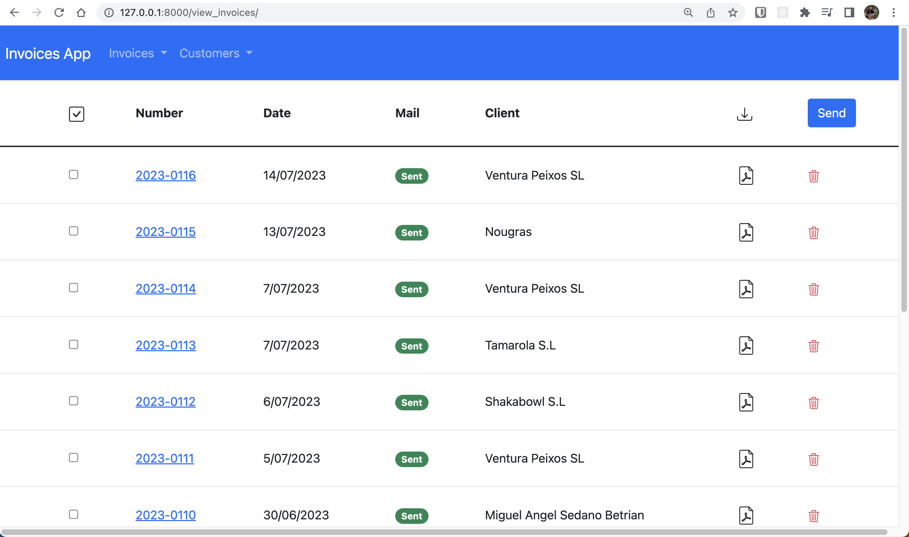
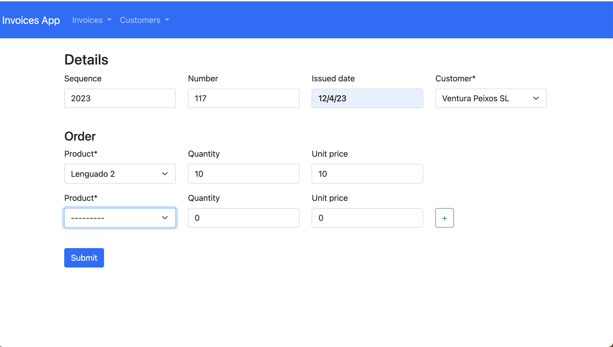

# Invoices App

This web application, built using the Django framework, allows users to effortlessly generate invoices and send them via email. It is designed to streamline the invoicing process for businesses and individuals, enabling them to create professional-looking invoices and efficiently manage their billing operations.

## Screenshots

### View invoices
- Show all the invoices records.

### Form invoices
- Add a new invoice record.

## Contributing
Contributions to this project are welcome. If you encounter any issues or have suggestions for improvement, please open an issue on the GitHub repository. Feel free to submit pull requests with new features, bug fixes, or documentation enhancements.

## License
This project is licensed under the MIT License. You are free to use, modify, and distribute the code for both commercial and non-commercial purposes.