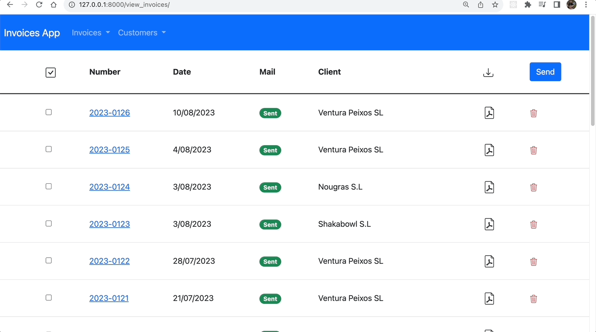

# Invoices App

This web application, built using the Django framework, allows users to generate invoices and send them via email. It is designed to streamline the invoicing process for small businesses, enabling them to efficiently manage their billing operations.

## Demo

A quick demo of how to add a new invoice and show its preview.



## Requirements

It's mandatory to set up the .env file to enable the mailing functionality. There's an example of this file in the app folder.

## How to use

Follow these instructions to set up a Python virtual environment (venv) and install the necessary dependencies to run the application.

1. Open a terminal or command prompt.

2. Create a virtual environment using Python 3.9 by running the following command:

```bash
python3.9 -m venv env
```

3. Activate the virtual environment by running the appropriate command for your operating system:
- For macOS and Linux:
```bash
source env/bin/activate
```
- For Windows:
```bash
.\env\Scripts\activate
```
Note: Activating the virtual environment isolates the Python environment for this project, preventing any conflicts with other Python installations on your system.

4. Upgrade pip, the package installer for Python, to the latest version by running the following command:

```bash
pip install --upgrade pip
```

5. Install the required dependencies specified in the requirements.txt file by running the following command:

```bash
pip install -r requirements.txt
```

6. You have successfully set up the environment with Python venv. Now you can proceed with running the application.
Note: Remember to activate the virtual environment (source env/bin/activate for macOS and Linux, or .\env\Scripts\activate for Windows) each time you work on the project or run the application.

By following these instructions, you should have your environment ready to run the application without any issues.


## Contributing
Contributions to this project are welcome. If you encounter any issues or have suggestions for improvement, please open an issue on the GitHub repository. Feel free to submit pull requests with new features, bug fixes, or documentation enhancements.

## License
This project is licensed under the MIT License. You are free to use, modify, and distribute the code for both commercial and non-commercial purposes.
